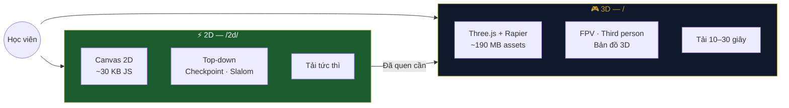
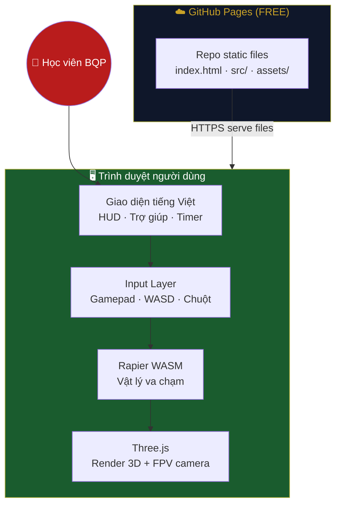
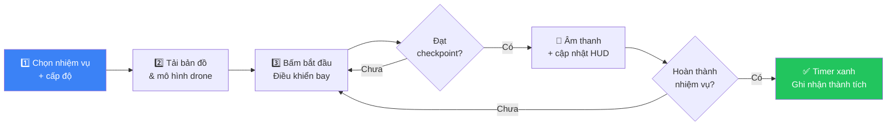
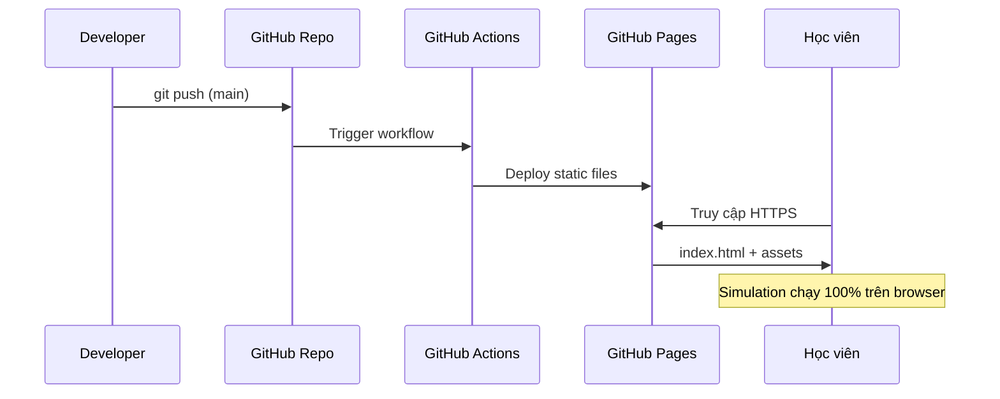
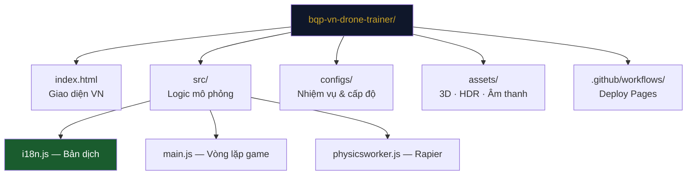
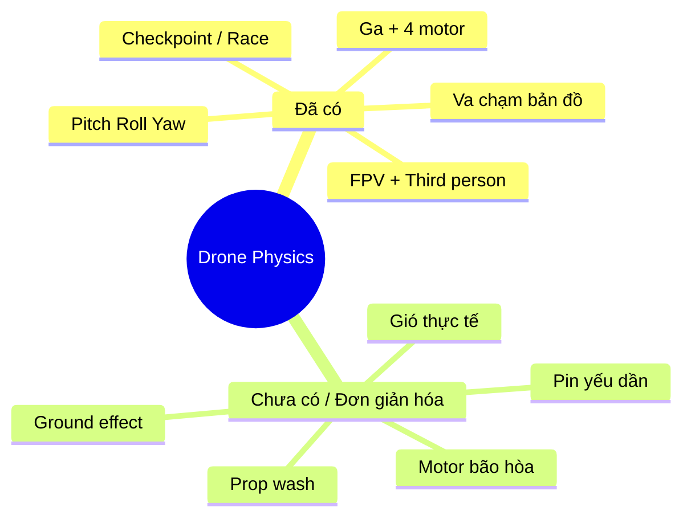

# BQP VN — Huấn luyện Kỹ năng Drone FPV

> **Mô phỏng web tĩnh** huấn luyện điều khiển drone — chạy hoàn toàn trên trình duyệt.

**Chơi ngay (2D — khuyến nghị):** [willtran112358.github.io/bqp-vn-drone-trainer/2d/](https://willtran112358.github.io/bqp-vn-drone-trainer/2d/)

> Trang gốc `/` tự chuyển hướng sang 2D. Phiên bản **3D FPV tạm ẩn** (asset ~190 MB, dễ lag khi tải).

---

## Tóm tắt nhanh

| | |
|---|---|
| **Loại** | Static web app (HTML + JavaScript) |
| **Chi phí host** | **Miễn phí** qua [GitHub Pages](https://pages.github.com/) |
| **Stack (2D)** | Canvas 2D · Web Gamepad API — **~30 KB** |
| **Stack (3D)** | Three.js · Rapier — *tạm ẩn, dev only* |
| **Gốc tham khảo** | Fork & Việt hóa từ [propwash](https://github.com/mqnc/propwash) |
| **Trạng thái** | Prototype — phù hợp huấn luyện cơ bản |

---

## Phiên bản 2D vs 3D



| | **2D** (`/2d/`) | **3D** (`/`) |
|---|----------------|--------------|
| Kích thước | **~30 KB** code, 0 asset | ~190 MB assets |
| Góc nhìn | Top-down (từ trên) | FPV + góc thứ 3 |
| Vật lý | Đơn giản hóa 2D | Rapier WASM 3D |
| Phù hợp | Làm quen cần Mode 2, checkpoint | Bay thực chiến, bản đồ phức tạp |
| Nhiệm vụ | Slalom, hạ cánh điểm đích | Issum, bóng bay, sân tập 3D |

### Nhiệm vụ 2D

| Nhiệm vụ | Mô tả |
|----------|--------|
| Sân tập tự do | Làm quen ga, xoay, di chuyển |
| Slalom cơ bản | 4 checkpoint |
| Đường hẹp | 8 checkpoint + chướng ngại |
| Hạ cánh điểm đích | Bay vào vùng đáp, giữ ổn định 2 giây |

---

## Kiến trúc hệ thống



**Không có backend, database hay server tính toán.** Toàn bộ mô phỏng chạy trên máy người dùng — GitHub Pages chỉ phục vụ file tĩnh.

---

## Luồng huấn luyện



---

## So sánh cấp độ huấn luyện

```mermaid
quadrantChart
    title Cấp độ huấn luyện vs độ khó điều khiển
    x-axis Dễ điều khiển --> Khó điều khiển
    y-axis Phản ứng chậm --> Phản ứng nhanh
    quadrant-1 Pro / Nâng cao
    quadrant-2 Trung cấp
    quadrant-3 Cơ bản
    quadrant-4 Tự do (Freestyle)
    "Cơ bản (co-ban)": [0.2, 0.25]
    "Trung cấp (trung-cap)": [0.5, 0.55]
    "Nâng cao (nang-cao)": [0.85, 0.9]
    "Sân tập tự do": [0.4, 0.7]
```

---

## Điều khiển

### Tay cầm (khuyến nghị) — Layout Mode 2

| Cần | Chức năng |
|-----|-----------|
| Trái ↑↓ | **Ga** — tăng / giảm độ cao |
| Trái ←→ | **Yaw** — xoay trái / phải |
| Phải ↑↓ | **Pitch** — tiến / lùi |
| Phải ←→ | **Roll** — nghiêng trái / phải |

### Bàn phím + chuột

| Phím | Chức năng |
|------|-----------|
| `W` `A` `S` `D` | Cần trái (ga + xoay) |
| Chuột | Cần phải (pitch + roll) — *bấm vào màn hình trước* |
| `1` – `4` | Đổi chế độ điều khiển (Mode 2 mặc định) |
| `R` | Quay lại vị trí ~1 giây trước |
| `Space` | Chuyển FPV ↔ góc nhìn thứ 3 |
| `H` | Mở / đóng bảng trợ giúp |

### 4 chế độ bay (Flight Mode)

| Mode | Layout | Phù hợp |
|------|--------|---------|
| **1** | Ga ở cần phải | Một số tay cầm cũ |
| **2** | Ga ở cần trái ⭐ | **Chuẩn FPV / radio thật** |
| **3** | Ga trái, xoay ở cần phải | Biến thể |
| **4** | Acro / không ổn định | Pilot có kinh nghiệm |

---

## Nhiệm vụ huấn luyện

| Nhiệm vụ | Cơ bản | Trung cấp | Nâng cao |
|----------|--------|-----------|----------|
| **Sân tập — Tự do** | [Chơi](https://willtran112358.github.io/bqp-vn-drone-trainer/?config=configs/san-tap.json5,configs/co-ban.json5) | [Chơi](https://willtran112358.github.io/bqp-vn-drone-trainer/?config=configs/san-tap.json5,configs/trung-cap.json5) | [Chơi](https://willtran112358.github.io/bqp-vn-drone-trainer/?config=configs/san-tap.json5,configs/nang-cao.json5) |
| **Leo tháp / Tháp lâu đài** | [Chơi](https://willtran112358.github.io/bqp-vn-drone-trainer/?config=configs/nhiem-vu-thap-lau.json5,configs/co-ban.json5) | [Chơi](https://willtran112358.github.io/bqp-vn-drone-trainer/?config=configs/nhiem-vu-thap-lau.json5,configs/trung-cap.json5) | [Chơi](https://willtran112358.github.io/bqp-vn-drone-trainer/?config=configs/nhiem-vu-thap-lau.json5,configs/nang-cao.json5) |
| **Phá 12 bóng bay** | [Chơi](https://willtran112358.github.io/bqp-vn-drone-trainer/?config=configs/nhiem-vu-bong-bay.json5,configs/co-ban.json5) | [Chơi](https://willtran112358.github.io/bqp-vn-drone-trainer/?config=configs/nhiem-vu-bong-bay.json5,configs/trung-cap.json5) | [Chơi](https://willtran112358.github.io/bqp-vn-drone-trainer/?config=configs/nhiem-vu-bong-bay.json5,configs/nang-cao.json5) |
| **Thành phố Issum — Tự do** | [Chơi](https://willtran112358.github.io/bqp-vn-drone-trainer/?config=configs/issum.json5,configs/co-ban.json5) | [Chơi](https://willtran112358.github.io/bqp-vn-drone-trainer/?config=configs/issum.json5,configs/trung-cap.json5) | [Chơi](https://willtran112358.github.io/bqp-vn-drone-trainer/?config=configs/issum.json5,configs/nang-cao.json5) |

> Tùy chỉnh drone: tạo file trong `configs/` rồi load qua URL  
> `?config=configs/san-tap.json5,configs/co-ban.json5`

---

## Host miễn phí — GitHub Pages



| Hạng mục | Chi tiết |
|----------|----------|
| **Chi phí** | **$0** — public repo |
| **Giới hạn** | ~100 GB bandwidth/tháng (đủ vài nghìn–vài chục nghìn lượt) |
| **Yêu cầu** | Bật Pages: *Settings → Pages → Source: GitHub Actions* |
| **URL mặc định** | `https://<username>.github.io/bqp-vn-drone-trainer/` |
| **Thay thế miễn phí** | Vercel, Netlify, Cloudflare Pages |

Repo gốc [propwash](https://github.com/mqnc/propwash) cũng host y hệt — mục **Deployments → github-pages** trên GitHub.

---

## Chạy local

```bash
# Clone repo
git clone https://github.com/willtran112358/bqp-vn-drone-trainer.git
cd bqp-vn-drone-trainer

# Serve static (Python 3)
python -m http.server 8000

# Mở trình duyệt
# http://localhost:8000?config=configs/san-tap.json5,configs/co-ban.json5
```

---

## Cấu trúc thư mục



---

## Vật lý — những gì được (và chưa) mô phỏng



> Mục tiêu là **huấn luyện phản xạ điều khiển**, không thay thế simulator PX4/Gazebo hay bay thật.

---

## Lộ trình phát triển

- [ ] Bảng xếp hạng nội bộ (localStorage)
- [ ] Thêm sân tập / checkpoint theo kịch bản BQP
- [ ] Hỗ trợ điều khiển bằng phím mũi tên (dễ hơn chuột)
- [ ] Chế độ chậm (slow-motion) cho học viên mới
- [ ] Tích hợp ghi nhận tiến độ qua backend (tùy chọn sau)

---

## Ghi công & Giấy phép

Dự án dựa trên [propwash](https://github.com/mqnc/propwash) (MIT) — xem [ATTRIBUTION.md](ATTRIBUTION.md).

Tài nguyên 3D, HDR, âm thanh giữ **nguyên license gốc** — không relicensed MIT.

| Thành phần | Nguồn | License |
|------------|-------|---------|
| Code gốc | [mqnc/propwash](https://github.com/mqnc/propwash) | MIT |
| Three.js | [mrdoob/three.js](https://github.com/mrdoob/three.js) | MIT |
| Rapier | [dimforge/rapier](https://rapier.rs/) | Apache-2.0 |
| Mô hình drone | [BlueMesh / Sketchfab](https://skfb.ly/6zBPO) | CC BY 4.0 |
| Bản đồ | Xem [ATTRIBUTION.md](ATTRIBUTION.md) | CC BY 4.0 / CC BY-NC-SA |

---

## Đóng góp

Mở Issue hoặc Pull Request trên GitHub. Cần hỗ trợ tinh chỉnh thông số drone, thiết kế nhiệm vụ huấn luyện, hoặc bản đồ mới.

**Lưu ý:** Đây là công cụ huấn luyện mô phỏng — không thay thế huấn luyện thực địa và tuân thủ quy định pháp luật về UAV.
